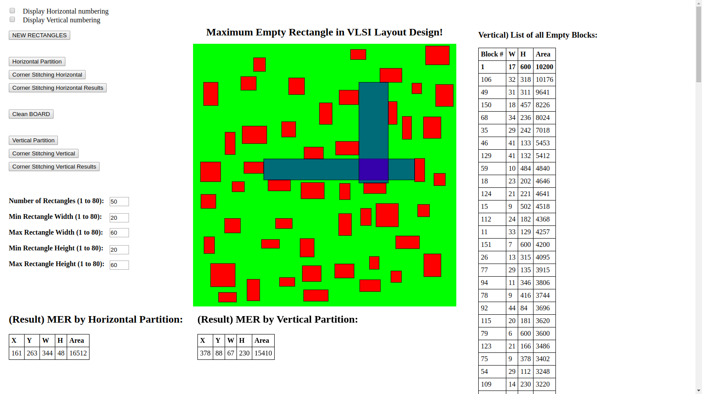

# Maximum Empty Rectangle in VLSI Layout Design using Corner Stitching Data Structure

Given N non-overlapping rectangles in a VLSI board, find the maximum empty rectangle in the board.

### Try it out here: https://vaibhav-2611.github.io/Maximum-Empty-Rectangle/

